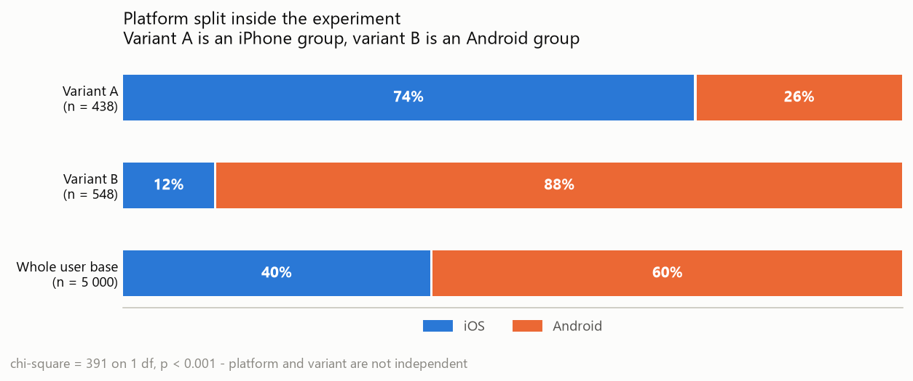
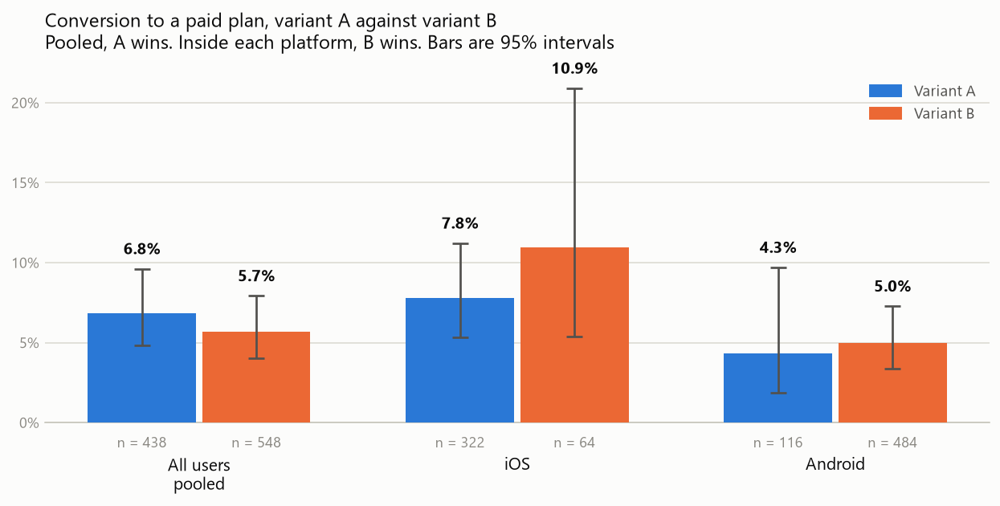
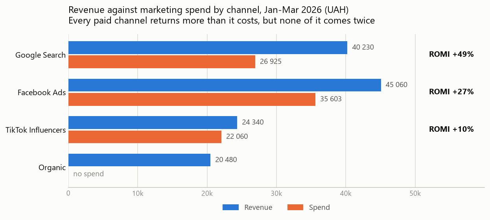

# Findings: a product that sells once and a test that cannot be read

What was measured: `ad_hoc_task.sql` (retention, lesson difficulty, test duration),
`ab_test_cr.sql` and `main.py` (the A/B test), `measures_and_check.sql`
(channel economics and log quality). Figures: `docs/make_charts.py`.
Data: `ed_tech_proj` in PostgreSQL, 40 033 rows, 5 000 users,
period 01.01.2026 - 31.03.2026. The KPI layer is built in Power BI (DAX).

All numbers below were re-run against the database on 17.08.2026.

---

## Summary

1. **The A/B test cannot answer its own question.** Variant A is 74% iPhone users,
   variant B is 12%. The whole user base is 40%. The randomiser did not split
   people, it split platforms.
2. **Because of that split the result flips direction.** Pooled together, A wins
   (6.8% against 5.7%). Inside iOS and inside Android, B wins in both. This is
   Simpson's paradox, and here the pooled number is the wrong one.
3. **Nothing in the test is significant anyway.** The test is too small by roughly
   a factor of four. Even the strongest effect we see would need about 1 300 users
   per group to be measurable, and iOS variant B has 64.
4. **Nobody buys twice.** 0 users out of 5 000 have a second subscription. The
   whole revenue of the product, 130 110 UAH, is 299 first purchases.
5. **The paid channels do pay back, but only just.** ROMI is +49% for Google
   Search, +27% for Facebook Ads, +10% for TikTok. LTV / CAC is 1.5 against a
   healthy level of 3.
6. **The "hardest lesson" ranking is noise.** The gap between the easiest and the
   hardest lesson is 0.75 points out of 100. A permutation test gives p = 0.88 —
   shuffled scores produce a bigger gap than the real ones do.

---

## 1. Why the A/B test cannot be used

`ab_onboarding_v2` covers every user who registered from 01.02.2026, so the
population is complete: 986 users, no filtering. The problem is not who entered
the test. It is how they were assigned.

| Group | Users | iOS | Android |
|---|---|---|---|
| Variant A | 438 | 322 (73.5%) | 116 (26.5%) |
| Variant B | 548 | 64 (11.7%) | 484 (88.3%) |
| Whole user base | 5 000 | 1 977 (39.5%) | 3 023 (60.5%) |

Chi-square on this table is 391 with 1 degree of freedom. Platform and variant are
not independent — they are almost the same variable. Comparing A against B is
comparing iPhone users against Android users.

There is a second, smaller problem: the split itself is 44.4 / 55.6 instead of
50 / 50 (chi-square 12.3, p = 0.0005). That is a sample ratio mismatch. On its own
it would already be a reason to stop and check the assignment code.

**The point is not that the numbers are bad. The point is that no analysis of this
data can separate the onboarding change from the platform.** Segmenting does not
fix it either — it only makes the groups smaller.

## 2. The direction of the result depends on how you cut it

| Cut | Variant A | Variant B | Difference | p-value |
|---|---|---|---|---|
| All users pooled | 6.8% (30/438) | 5.7% (31/548) | A +1.2 pp | 0.44 |
| iOS only | 7.8% (25/322) | **10.9% (7/64)** | B +3.2 pp | 0.40 |
| Android only | 4.3% (5/116) | **5.0% (24/484)** | B +0.6 pp | 0.77 |

Read the first row and variant A looks better. Read the next two and variant B is
better on every platform that exists. Both statements come from the same table.

The reason is in section 1. iOS users convert about twice as well as Android users
(around 8-11% against 4-5%), and variant A holds most of the iOS traffic. A is not
winning — it was handed the better audience.

The bootstrap in `main.py` (10 000 resamples) says the same thing in a different
way. The 95% interval for the pooled difference A − B is **[−1.8 pp, +4.3 pp]**. It
contains zero. In 22% of the resamples A is behind B.

**How much data would be needed.** To detect the iOS gap (10.9% against 7.8%) with
80% power at alpha 0.05, each group needs about **1 320 users**. Today iOS variant B
has 64. In February and March the product got about 17 new users a day, so a clean
test would run for roughly five more months — and registrations are falling
(4 014 in January, 799 in February, 187 in March), so in practice it would be
longer.

**Recommendation:** do not ship either variant on this evidence. Fix the assignment
first — hash the `user_id`, not anything that correlates with the device — then
re-run with the platform as a stratum, so both variants get the same iOS share by
construction.

## 3. Retention: the 7-day number is real, the 30-day number is not

`ad_hoc_task.sql` measures how many days pass between registration and the user's
last lesson or test.

| Cohort | Users with activity | day 1 | day 7 | day 30 |
|---|---|---|---|---|
| January | 3 657 | 99.2% | 94.7% | 0% |
| February | 736 | 99.5% | 93.8% | 0% |

Two things have to be said about this table before anyone quotes it.

**The 30-day zero is a property of the dataset, not of the product.** No user in the
whole database has any activity later than 19 days after registration
(`MAX(completed_at - registration_date) = 19`). The generator never writes it. So
30-day retention is not "very bad" — it is **not measurable here**, and the same is
true of anything that needs a window longer than three weeks.

**The denominator is users who did something, not users who registered.** 4 504 of
5 000 users have at least one lesson or test; the other 496 never appear in the
activity tables at all. Counting those in, January day-7 retention drops from 94.7%
to about 85%. The query also uses `BETWEEN`, so 01.02.2026 is counted in both
cohorts (50 users).

One more naming point: the metric answers "was this user still active on day N or
later", not "was this user active on day N". That is a lifespan metric. It is a
reasonable proxy, but it should not be shown on a dashboard next to a classic
retention curve.

## 4. Zero renewals, and what that does to the economics

| Check | Result |
|---|---|
| Users with 2 or more subscriptions | **0** |
| Subscriptions total | 299 |
| Active on 31.03.2026 | 147 |
| Already expired | 152 |

Half of all subscriptions ever sold had already expired by the end of the data, and
not one of them came back. This is the single most important number in the project,
and it does not depend on any of the bugs discussed below.

It also changes what LTV means. With no second purchase, LTV is just the average
first payment, and every unit-economics number is a one-shot number:

| Metric | Value | How it is built |
|---|---|---|
| Revenue, January cohort | 104 830 UAH | all purchases by users who registered in January |
| Users, January cohort | 4 014 | |
| LTV | **26.12 UAH** | revenue / users |
| Spend, whole period | 84 588 UAH | `SUM(cost)` from `marketing_costs` |
| CAC | **16.92 UAH** | spend / 5 000 users |
| LTV / CAC | **1.54** | healthy is 3 or more |

**A correction to the dashboard.** The current DAX measure builds LTV as
*(cohort revenue − January spend) / cohort users* and then divides that by CAC.
That subtracts the acquisition cost twice — once inside LTV, once in the ratio —
and reports 1.1 instead of 1.54. It also mixes periods: the numerator uses January
spend while CAC uses the whole quarter. LTV should be gross revenue per acquired
user; the cost belongs in the denominator only.

Neither version changes the conclusion. 1.5 is above water and far below healthy,
and it is built on a single payment per customer.

## 5. Channels: all three paid ones return more than they cost

| Channel | Users | Payers | Spend | Revenue | CAC | CAC premium | ARPPU | ROMI |
|---|---|---|---|---|---|---|---|---|
| Google Search | 1 480 | 95 | 26 925 | 40 230 | 18.19 | 283.42 | 423.47 | **+49%** |
| Facebook Ads | 1 536 | 99 | 35 603 | 45 060 | 23.18 | 359.63 | 455.15 | +27% |
| TikTok Influencers | 980 | 55 | 22 060 | 24 340 | 22.51 | 401.09 | 442.55 | +10% |
| Organic | 1 004 | 50 | — | 20 480 | — | — | 409.60 | — |

The useful comparison is the last two paid columns: **CAC premium against ARPPU**.
That is what it costs to buy one paying customer against what that customer
actually pays. Google Search buys a payer for 283 and gets back 423. TikTok pays
401 to get back 443 — a margin of 41 UAH per customer, which one bad week of ad
prices would erase.

Conversion to paid is nearly flat across channels (6.5% Facebook, 6.4% Google, 5.6%
TikTok, 5.0% Organic), so the ROMI difference is a price difference, not a quality
difference. TikTok is not bringing worse users, it is charging more for the same
ones.

**A note on a bug that was fixed.** `cost` in `marketing_costs` is the spend of a
channel for a whole day. An earlier version of the `user_sub` view joined that
table on `registration_date`, which attached the full daily amount to every user
who registered that day — if 10 people came from one channel on one day, the day
was counted 10 times. That produced a CAC in the thousands and a negative ROMI
everywhere, and the conclusion at the time was "the campaign failed". It had not.
Spend is now taken straight from `marketing_costs`, with no join to users.

**This bug is not fully cleaned up.** The live `user_sub` view still exposes a
column called `acquistion_cost`, and it now holds `duration_days` — plan length in
days, 30 / 90 / 180. Any query that trusts the name will get plan duration and call
it money. The column should be renamed back to `duration_days` or dropped.

## 6. Lesson difficulty: a ranking of nothing

`ad_hoc_task.sql` ranks the three lowest-scoring lessons per subject. The first
check in that file is the right one — it counts completions per lesson, so an
unpopular lesson is not mistaken for a hard one — and it passes: every lesson has
between 1 620 and 1 741 completions, and every student takes a lesson only once
(25 166 rows, 25 166 distinct user-lesson pairs).

The problem is the spread.

| Subject | Lesson | Mean score | Completions |
|---|---|---|---|
| 1 | 3 | 79.66 | 1 723 |
| 1 | 5 | 79.81 | 1 696 |
| 1 | 1 | 79.87 | 1 657 |
| 2 | 8 | 79.87 | 1 652 |
| 2 | 7 | 79.99 | 1 688 |
| 3 | 12 | 79.59 | 1 620 |
| 3 | 11 | 79.98 | 1 661 |

All 15 lessons sit between 79.59 and 80.34. The gap between the hardest and the
easiest lesson in the whole product is **0.75 points**, and the standard error of
each lesson mean is about 0.29.

A permutation test settles it. Shuffle the scores across lessons 2 000 times and
measure the same max-minus-min gap: the median shuffled gap is **0.99**, larger
than the real one, and **p = 0.88**. There is no difficulty signal in this data.

The `difficulty` column agrees: lessons labelled `Hard` average 79.95 and lessons
labelled `Easy` average 80.13. The label and the scores are unrelated.

So the SQL is correct and the answer is "no such thing". A ranking always returns a
top 3, which is exactly why it needs a significance check before it reaches a
teacher.

Test attempts look the same way — clean and uninformative. 463 passing attempts
(score > 140), no student passes twice, duration 1h00m to 1h59m with a mean of
1h28m. The 2-hour limit holds and there is no one abusing it. Worth reporting as a
passed check, not as a finding.

## 7. Clickstream: one real bug, found by the third method

The event log has a technical failure on **15.02.2026**: 19 duplicated rows across
8 sessions and 8 users. Nothing on any other day. What matters is how it was found.

| Check | Result |
|---|---|
| Same user + same timestamp | 447 rows — but these are normal, different screens in the same minute |
| Same user + same timestamp + same screen | **0 rows** |
| Sessions per day > users per day | **0 days** |
| Two identical screens in a row (`LEAD`) | **19 rows, 8 sessions** |

The first three checks all pass, and all three are wrong. The duplicate row was
written with a **new `event_id` and a different timestamp**, so it is not a full
duplicate by any key. Only comparing each event to the next one in the session
finds it.

That is the transferable lesson here: a duplicate that was re-sent by a retrying
client does not look like a duplicate row. It looks like a user who opened the same
screen twice.

**Three more problems in the same table, none of them related to 15 February:**

- **`event_id` and `event_timestamp` disagree.** In 2 753 rows the `event_id` grows
  while the timestamp goes backwards. Ordering a funnel by `event_id` and ordering
  it by time give different answers. Every window function in this project orders
  by `event_id`, so the results are consistent — but they are consistent with an
  order that is not time.
- **`session_id` is not unique.** 1 500 logged users produce only 1 487 distinct
  session ids, and 13 ids are shared by more than one user. Any per-session metric
  silently merges those users.
- **DAU is not affected by the duplicate bug.** Every other day in the log has
  exactly 5.0 events per user. 15 February has 7.4 — 59 events from 8 users, and
  8 users is a normal day. Event counts moved, people did not. So DAU is safe, but
  any feature metric counted in events would read the failure as engagement.

## 8. The funnel is not a funnel

| Step | Unique users | Step conversion |
|---|---|---|
| Onboarding_1 | 1 500 | — |
| Onboarding_2 | 1 500 | 100% |
| Main_Dashboard | 1 500 | 100% |
| Lesson_List | 1 500 | 100% |
| Paywall | 1 500 | 100% |
| Purchase | 92 | **6.1%** |

Every logged user reaches every screen. That is not a product result — the
generator writes all five screens for all 1 500 sampled users, so there is nothing
to drop off. Only 8 sessions break the canonical order, and those are the
15 February duplicates.

The one number in this table that means something is the last one: **6.1% of
paywall viewers buy**. It matches the base rate of the whole product (299 / 5 000 =
6.0%), which is a good consistency check and a reminder that the four 100% rows
should never appear on a dashboard.

DAU is 18.1. MAU falls from 1 188 in January to 258 in February and 54 in March —
that is the shape of the registration curve, not of engagement.

---

## Priorities

1. **Fix the randomiser before running any other experiment.** Assignment must not
   correlate with platform. Until then, no A/B result in this product is evidence
   of anything.
2. **Work on the second purchase.** Zero renewals out of 299 subscriptions is the
   real economics of the product. A LTV / CAC of 1.5 built on one payment breaks
   the moment ad prices rise; the same number with one renewal per customer is
   healthy.
3. **Rename or drop `acquistion_cost` in `user_sub`.** It currently returns plan
   duration in days. This is a live trap, not a historical one.
4. **Correct the LTV measure in Power BI** so it does not subtract acquisition cost
   twice, and align its period with CAC.
5. **Review TikTok Influencers.** Same conversion as the other channels, highest
   price per payer, +10% ROMI. Either renegotiate the price or move the budget to
   Google Search.
6. **Add an ordering key to the event log** that agrees with time, and make
   `session_id` unique. Both are cheap to fix at the source and impossible to fix
   in analysis.

## What is not covered here

- **Churn and long-term retention.** The data stops 19 days after each user's
  registration, so nothing beyond three weeks can be measured. This is the biggest
  gap and it needs new data, not new queries.
- **Revenue by cohort over time.** The January cohort is the only one with enough
  users to follow, and it has one month of history. The cohort query in the
  write-up returns a real table for January and February and zeros after that.
- **A/B test on any metric except purchase.** Onboarding is more likely to move
  activation (first lesson completed) than payment. That metric exists in
  `user_lessons` and was not tested.
- **Why 496 users never opened a single lesson.** 10% of the base registers and
  disappears before any activity is logged. Nothing in the current tables explains
  it.
